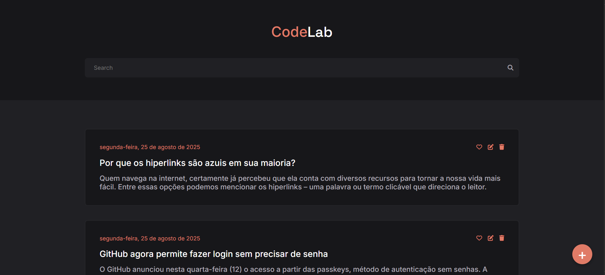

# CodeLab | Blog Front-end


*(Dica: Tire uma captura de ecrã do seu projeto e salve-a como `screenshot.png` na raiz do projeto para que esta imagem apareça)*

## 📝 Descrição

**CodeLab** é uma interface de blog moderna e totalmente interativa, construída com JavaScript puro (Vanilla JS), seguindo as melhores práticas de desenvolvimento, como a separação de responsabilidades (SoC), componentização de funcionalidades e princípios de Clean Code. Este projeto foi desenvolvido como parte de um desafio proposto por Iuri Silva ([@iuricode](https://github.com/iuricode)).

O projeto consome uma API REST mock para realizar operações de CRUD (Criar, Ler, Atualizar, Apagar) em posts de um blog, proporcionando uma experiência de usuário fluida e profissional com notificações dinâmicas e design responsivo.

## ✨ Funcionalidades

- **Listagem e Renderização de Posts**: Exibe os posts vindos da API, ordenados por data (mais recentes primeiro).
- **CRUD Completo de Posts**:
  - **Criar**: Adicionar novos posts através de um modal dinâmico.
  - **Editar**: Atualizar o título e o conteúdo de posts existentes, reutilizando o modal de criação.
  - **Apagar**: Excluir posts com um modal de confirmação customizado para evitar ações acidentais.
- **Marcar como Favorito**: Funcionalidade de "curtir" um post, com o estado a ser persistido na API.
- **Busca Type-Ahead**: Filtra os posts em tempo real enquanto o usuário digita na barra de pesquisa.
- **Notificações Toast**: Feedback visual para o usuário com toasts de sucesso e erro customizados, substituindo os alertas padrão do navegador.
- **Design Responsivo**: Interface adaptável para uma boa experiência em desktops, tablets e telemóveis.

## 🛠️ Tecnologias Utilizadas

- **Front-end**:
  - HTML5
  - CSS3
  - JavaScript (ES6+ com Módulos)

- **Bibliotecas/Ferramentas**:
  - [Axios](https://axios-http.com/): Para realizar as requisições HTTP à API.
  - [Font Awesome](https://fontawesome.com/): Para os ícones.
  - [JSON Server](https://github.com/typicode/json-server): Para simular uma API RESTful completa a partir de um ficheiro `db.json`.
  - [http-server](https://www.npmjs.com/package/http-server): Para servir os ficheiros estáticos localmente sem os problemas de recarregamento do Live Server.

## 🚀 Como Executar o Projeto

Siga os passos abaixo para executar o projeto na sua máquina local.

**Pré-requisitos:**
- [Node.js](https://nodejs.org/en/) (que inclui o `npm` e o `npx`).

**Passos:**

1.  **Clone o repositório:**
    ```bash
    git clone [https://github.com/dkhenrique/nome-do-repositorio.git](https://github.com/dkhenrique/nome-do-repositorio.git)
    ```

2.  **Navegue para a pasta do projeto:**
    ```bash
    cd nome-do-repositorio
    ```

3.  **Inicie o servidor da API (JSON Server):**
    Abra um terminal e execute o seguinte comando. Ele irá observar o ficheiro `db.json` e fornecer a API na porta 3000.
    ```bash
    npm start
    ```

4.  **Inicie o servidor do Front-end:**
    Abra um **segundo terminal** (mantenha o primeiro a executar o `json-server`) e execute o comando abaixo para servir os ficheiros do projeto.
    ```bash
    npx http-server -c-1 .
    ```

5.  **Acesse a aplicação:**
    Abra o seu navegador e acesse o URL fornecido pelo `http-server` (geralmente `http://127.0.0.1:8080`).

## 📂 Estrutura do Projeto

O projeto foi estruturado com uma clara separação de responsabilidades para facilitar a manutenção e escalabilidade.

```
├── .vscode/
│   └── settings.json      # Configuração para o VS Code ignorar o db.json
├── css/
│   └── style.css          # Todos os estilos visuais
├── js/
│   ├── api.js             # Camada de dados: lida com todas as chamadas Axios à API
│   ├── ui.js              # Camada de apresentação: lida com a manipulação do DOM
│   ├── main.js            # Camada de controlo: o "maestro" que lida com os eventos e orquestra as chamadas
│   ├── elements.js        # Módulo que centraliza a seleção de todos os elementos do DOM
│   └── toast.js           # Módulo de utilidade para as notificações toast
├── db.json                # Ficheiro da base de dados mock para o JSON Server
└── index.html             # Estrutura principal da página
```

## 🔮 Futuras Melhorias

- [ ] Implementar paginação para lidar com um grande número de posts.
- [ ] Adicionar um sistema de comentários para cada post.
- [ ] Implementar autenticação de usuários.

## 👤 Autor

**Daniel Henrique**

- GitHub: [@dkhenrique](https://github.com/dkhenrique)
- LinkedIn: [Daniel Henrique D. Santos](https://www.linkedin.com/in/daniel-henrique-d-santos/)